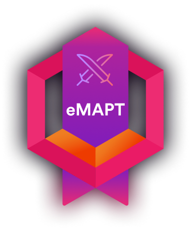
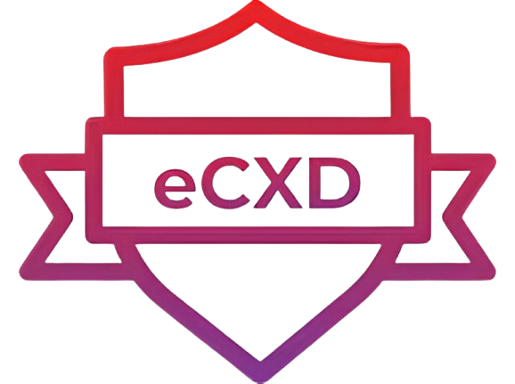
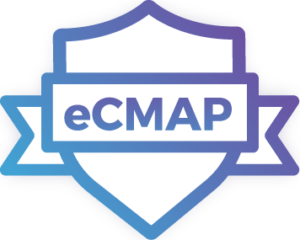
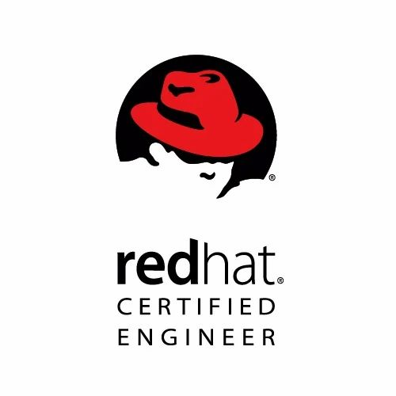
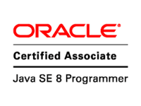
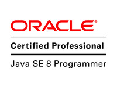

 

## <u>Cyber Security</u>

 
 

### eLearnSecurity Certified Mobile Application Penetration Tester eMAPT [<i class="fas fa-link" aria-hidden="true"></i>](https://ine.com)

- Information Gathering
- Reverse engineering Android applications
- Exploit Android vulnerabilities
- Applied security principles
- Logic flaws
- Exploit development for Android environments
- Encryption and cryptography
- Identify vulnerable implementations

---

### eLearnSecurity Certified Exploit Developer eCXD [<i class="fas fa-link" aria-hidden="true"></i>](https://ine.com)

- Windows and Linux internals
- Reverse engineering (x86 and x64 platforms)
- Software debugging
- Shellcoding
- Windows and Linux exploit development (including scripting knowledge)
- Bypassing modern anti-exploit mechanisms (ASLR/PIE, Stack Cookie, NX/DEP, RELRO etc.)
- Exploiting hardened hosts and overcoming limitations

---

### eLearnSecurity Certified Malware Analysis Professional eCMAP [<i class="fas fa-link" aria-hidden="true"></i>](https://ine.com)

- Run a malware and tracking its activity
- Reverse Engineering and/or unpacking malware
- Ability to debug malware step-by-step
- Identify how the malware achieves obfuscation
- Identify C2 channels and what they are used for
- Bypass anti-analysis techniques
- Locate and analyze dropped and downloaded malware as well as persistence mechanisms

 

## <u>DevOps</u>

 
 
 

### Red Hat Certified Linux Administrator 7 [<i class="fas fa-link" aria-hidden="true"></i>](https://ine.com)

---

### Red Hat Certified Linux Engineer 7 [<i class="fas fa-link" aria-hidden="true"></i>](https://ine.com)

---

### Oracle Certified Java 8 Association [<i class="fas fa-link" aria-hidden="true"></i>](https://ine.com)

---

### Oracle Certified Java 8 Professional [<i class="fas fa-link" aria-hidden="true"></i>](https://ine.com)

---
